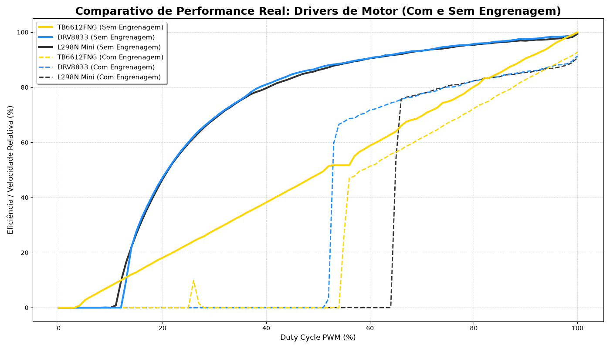

# Comparativo de Performance de Pontes H (Motor Drivers)

Este projeto tem como objetivo realizar um experimento prático para comparar a performance, eficiência e zona morta (dead zone) de diferentes drivers de motor DC (Pontes H), analisando o comportamento dos motores com e sem carga (engrenagens).

Os drivers analisados neste experimento são:
- **TB6612FNG**
- **DRV8833**
- **L298N Mini**

## 🛠️ Materiais Necessários

- Microcontrolador (Ex: Raspberry Pi Pico, utilizado nos scripts em MicroPython deste repositório).
- 1x Motor DC com Encoder de quadratura (fases C1 e C2).
- Módulos de Ponte H (TB6612FNG, DRV8833, L298N Mini).
- Fonte de alimentação externa para os motores (Bateria LiPo ou Fonte de Bancada).
- Jumpers e protoboard.
- Computador com Python 3 (bibliotecas `pandas`, `matplotlib`, `numpy`) para análise de dados.

## ⚙️ Como realizar o Experimento

O experimento consiste em aplicar variações no ciclo de trabalho (Duty Cycle) do PWM e medir a velocidade de resposta do motor contando os pulsos ("ticks") gerados pelo encoder. Isso é feito em duas etapas (com e sem a caixa de redução/engrenagem acoplada).

### Passo 1: Montagem do Circuito
1. **Motores e Encoders:** Conecte as fases C1 e C2 do encoder do motor aos pinos de interrupção do Raspberry Pi Pico configurados no código (por exemplo, Pinos 12 e 13 para o Motor A). Alimente os sensores do encoder com 3.3V (ou de acordo com a voltagem suportada pelo seu encoder).
2. **Ponte H:** Conecte os pinos de controle lógico da Ponte H (IN1, IN2, e PWM) aos pinos indicados no script `testemotores.py`.
3. **Alimentação:** **Sempre** conecte o terra (GND) do microcontrolador ao GND da Ponte H e da fonte externa. Conecte a fonte de alimentação externa diretamente na entrada de potência (VMOT, VCC ou V+) da Ponte H para não sobrecarregar o microcontrolador.

### Passo 2: Coleta de Dados
A coleta é dividida em dois cenários para cada driver testado:

1. **Sem Engrenagem (Sem Carga):** Remova a caixa de redução acoplada ao eixo do motor, deixando-o livre.
2. **Com Engrenagem (Com Carga):** Acople a caixa de redução ao motor para adicionar carga mecânica e simular o sistema em uso real.

Para cada Ponte H (nos dois cenários), siga os passos abaixo:
1. Faça o upload e execute o script MicroPython correspondente no Raspberry Pi Pico (como o `testemotores.py`).
2. O script aplicará um "sweep" (varredura) no PWM indo de 0 a 100%. Para cada patamar de PWM, o código conta a quantidade de *ticks* registrados pelo encoder num intervalo fixo de tempo.
3. Ao final da varredura, salve os resultados gerados (PWM vs Ticks) em formato `.csv`.
4. Organize os arquivos `.csv` nas pastas do projeto:
   - Os testes sem carga devem ser colocados na pasta `dados/` (Ex: `dados/tb6612fng.csv`, `dados/drv8833.csv`, `dados/l298nmini.csv`).
   - Os testes com carga mecânica devem ser colocados na pasta `dadosengrenagem/` (Ex: `dadosengrenagem/tb6612fng.csv`, etc.).

### Passo 3: Geração dos Gráficos e Comparativo
Após todas as coletas finalizadas e organizadas, utilize o script de gráficos no computador para visualizar os resultados.

Abra um terminal no diretório do projeto e digite:
```bash
# Caso não tenha as dependências instaladas:
pip install pandas matplotlib numpy

# Execute o script de plotagem:
python graficos.py
```

O script lerá automaticamente as pastas `dados/` e `dadosengrenagem/` e fará a sobreposição das curvas de performance de todos os drivers. 
- **Linhas Contínuas:** Representam a performance de motores sem engrenagem.
- **Linhas Tracejadas:** Representam a performance de motores com engrenagem acoplada.

## 📊 Resultados

Abaixo está o gráfico comparativo obtido com o experimento:



### O que avaliar neste gráfico?
- **Dead Zone (Zona Morta):** Nos valores iniciais de PWM o motor se recusa a rodar. Diferentes pontes H apresentam diferentes níveis de queda de tensão, alterando o ponto onde a inércia é finalmente quebrada.
- **Eficiência Máxima Absoluta:** O pico do eixo Y indica a velocidade terminal. Drivers com transistores MOSFET (como o TB6612 e DRV8833) tendem a esquentar menos e entregar mais tensão ao motor do que ponte H baseada em transistores Bipolares (como o L298N).
- **Carga vs Vazio:** O espaçamento entre a linha tracejada e a contínua de uma mesma cor demonstra a perda de performance gerada pela resistência mecânica das engrenagens da caixa de redução.